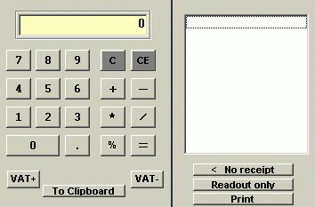



## CalculatorApp

### Description

I found a calc on PSC, Herman Lui´s, to which I added some functions. Such as, listbox to display your calculations/inputs, print receipt, ability to change layout during runtime. F-key, percentage-key, VAT-key functions. Allways on top. Help and aboutform. The objctive was that the user should be able to operate the calculator by using the keyboard. Of course the mouse works to. This Calculator is aslo included in my Financial Analysis App.
 
### More Info
 

             |
---                |---
**Submitted On**   |2001-05-29 19:41:28
**By**             |[nalle](https://github.com/Planet-Source-Code/PSCIndex/blob/master/ByAuthor/nalle.md)
**Level**          |Beginner
**User Rating**    |3.6 (18 globes from 5 users)
**Compatibility**  |VB 4\.0 \(32\-bit\), VB 5\.0, VB 6\.0
**Category**       |[Complete Applications](https://github.com/Planet-Source-Code/PSCIndex/blob/master/ByCategory/complete-applications__1-27.md)
**World**          |[Visual Basic](https://github.com/Planet-Source-Code/PSCIndex/blob/master/ByWorld/visual-basic.md)
**Archive File**   |[Calculator202295292001\.zip](https://github.com/Planet-Source-Code/nalle-calculatorapp__1-23562/archive/master.zip)

### API Declarations

Allways on top

